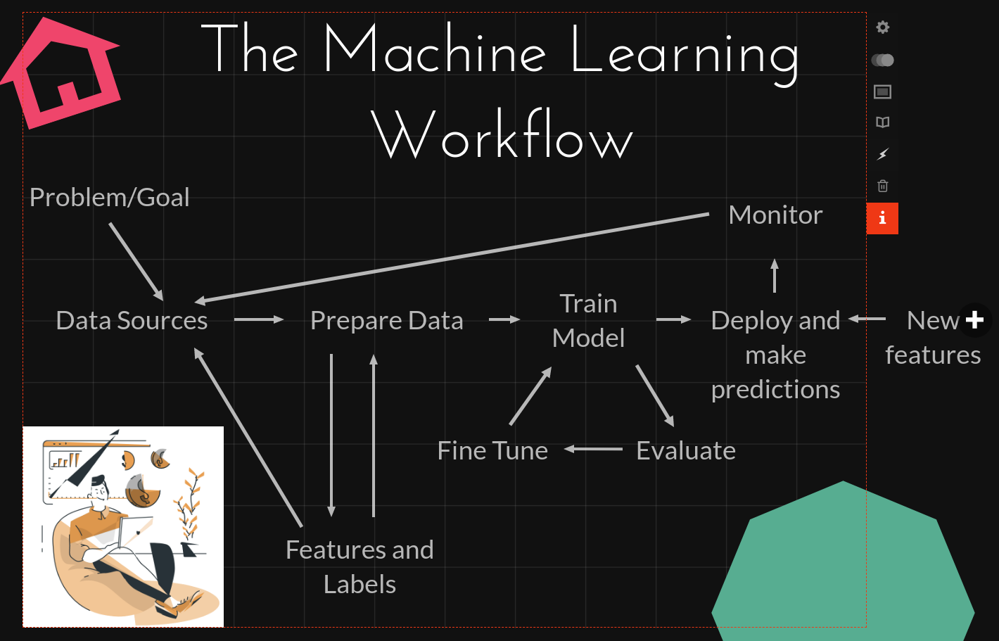

# Metrics Stores vs Feature Stores

Deriving value from data, whether for consumption or further value generation within a (machine learning) system, requires careful engineering, design thinking, and a team of motivated problem solvers with a shared goal. To accomplish this task, deriving value from data, we have the metrics store and the feature store.

## Table of Contents

1. Overview
2. Metrics
3. Metrics Stores
4. Features
5. Features Stores
6. Advantages and Similarities
7. Disadvantages and Differences
8. Why do we need Stores?
9. When should you adopt either?
10. What should I look for in either solution?
11. Recap

TL;DR

> "You should consider Metrics Stores and Feature Stores as part of the building blocks of your data and ML stacks when, regardless of the size of your org, you have different teams building products or deriving insights from the same information in a consistent way."

## 1. Overview (Motivating your KPIs and Movies Recommendations)

An almost ubiquitous aspect of modern life is that most of us have and need a job to put food on the table and pay for services such as Netflix, which provide us with entertainment for our lazy Sunday fix. To get through our jobs, and be successful in our chosen careers, some of us need to achieve goals that are usually measured in terms of Key Performance Indicators (KPIs) or metrics. These KPIs might directly or indirectly affect the performance of our team or a key parameter of the success of our company. On the other hand, for Netflix to personalize our experience on those lazy Sundays, and recommend us the next best movie, it needs to know some of the characteristics, or features, that make us who we are in and outside of the platform (e.g., gender, age, most-watched genre, ...). You could say that some aggregation of us and others similar to us are part of Netflix's KPIs.

The number of metrics and features needed for each -- work and a custom experience -- can be plenty and their complexity (i.e., the ways in which each is generated) has no creative ceiling. In other words, just as purchasing a carton of milk and a t-shirt could be done at their respective dairy and cotton farms, generating metrics and features could be done from their respective databases. What we want would just need to be assembled by milking the cows, sewing the cotton, and writing SQL queries. Luckily, to solve all these problems we have convenience, clothing, metrics and feature stores, and in this blog post we'll cover the latter two, so let's start with metrics.

## 2. Metrics

Out of the many similarities companies share, the most notable one is that they all have metrics they need to track to observe the overall progress of their organizations. After all, regardless of the product or service a company may provide, "if you can not measure it, you cannot improve it."

A more technical definition of metrics tells us that these are *quantifiable measures used to track and assess the status of a specific process at a given point in time*. To put this into perspective, imagine that you are in the business of selling a nicely packaged bundle of spirits with mixers (a.k.a. you own a bar and sell, well, cocktails), and that you'd like to know, as precisely as possible, how many and which cocktails or beers give you the most financial return for you to pay for you establishment's rent, staff salary, overall supplies, etc. One way to figure this out would be by calculating the metrics `revenue_per_signature_cocktail` (which contains all of the signature cocktails you have worked so hard to create) and `revenue_per_classic_drink` (which may contain beers or some of the classics such as an old fashion, a Manhattan, or a cosmopolitan, among others).

These metrics would help us observe and understand how what we provide to our customers will affect the bottom line of our business. Metrics may not mean much to people outside our bar, but they represent a map we should use to help guide us towards one or more goals, e.g. to be the best bar in the world. To illustrate how these metrics get created, assume all of your transactions get placed into a table such as the following one.

| Idx | Item (S=Signature)       |Price|    Date   |Quantity|Signature|
|:---:|:------------------------:|:---:|:---------:|-------:|:-------:|
|  0  | Old Fashion              |  17 | 03-Jan-22 |    2   |    0    |
|  1  | Shiny Palace (S)         |  24 | 03-Jan-22 |    4   |    1    |
|  2  | Multi-vodkaTini (S)      |  23 | 03-Jan-22 |    1   |    1    |
|  3  | Pale Ale                 |   7 | 03-Jan-22 |    3   |    0    |
|  4  | Lager                    |   6 | 04-Jan-22 |    3   |    0    |
|  5  | Crazy Tiki Tower (S)     |  28 | 04-Jan-22 |    2   |    1    |
|  6  | Bananalicious Martini (S)|  25 | 04-Jan-22 |    1   |    1    |
|  7  | Aperol Spritz            |  15 | 04-Jan-22 |    2   |    0    |
|  8  | Caribbean Sugarum (S)    |  25 | 05-Jan-22 |    2   |    1    |
|  9  | Watermelicious (S)       |  28 | 05-Jan-22 |    1   |    1    |
| 10  | Manhattan                |  17 | 05-Jan-22 |    3   |    0    |
| 11  | Brown Ale                |   7 | 05-Jan-22 |    4   |    0    |

When we think of metrics we think of aggregated results by different dimensions. In this instance, a dimension is the same as a column in the table above and a measure to aggregate a dimension by usually involved time. For example, tracking the average revenue made, the emails sent out for ad campaigns, the churn experienced, and others, only (or mostly) make sense from a trend perspective. This means that we want to see the sums, averages, and the like by the minute, hour, day, week, or any other value to reason about their change from X point in the past to today. That said, the previously afforemetioned metrics would look  as follows after being calculated (we'll talk about the computation process in the next section).

| day_of_year | revenue_per_classic_drink | revenue_per_signature_cocktail |
|:-----------:|:---:|:--------:|
|  Day 3    | 55 | 119 |
|  Day 4    | 48 | 81 |
|  Day 5    | 81 | 50 |

In addition to those in bars and restaurants, metrics vary by industry and company, but there are overlaps across both. For example, different dating apps optimize daily active users (DAU), which is the ratio between users that log into the app on a given day, over the number of all users registered on the app at that point in time. While this example may seem very context-specific, DAU is a universal metric for companies with a subscription service like Spotify (a music provider) and the NY Times (a news provider). In contrast, metrics that are specific to a product, especially those with a patent behind them, will be unique and valuable for the company developing or using such a product. For example, the gaming industry is notorious for its patent applications and, as such, some of their metrics range from complex marketplaces using real currency within games to new video rendering systems that increase the quality of a game.

As you can imagine, all these metrics require data and companies collect it in different varieties, with distinct velocity, veracity, and validity. Moreover, different departments such as finance and marketing might need to create unique metrics or share similar ones across an organization in any industry. After all, if we wanted to create a report based on the metrics from these two teams, we'd like to use the finance's team revenue recipe, and the marketing's team ad conversion recipes rather than one curated by anyone else in the company. Beyond acquiring such metrics, we would use downstream applications for analysis to enable better decision-making processes. With this in mind, it follows that there has to be a good way to collaborate across teams and keep track of what's important to our companies, and that solution is what we'll cover next, the Metrics Stores.

## 3. Metrics Stores

Think about the last time you went to your local supermarket, chances are, you knew the items you needed, the aisle where they were located, and the ballpark price of your bill -- unless we go back to the height of COVID-19, where we would take what we could get. With that in mind, having a metrics store at your organization is like having a supermarket right next to where you live, it's a convenient place (and at a great location) to get the essentials and more. So you can think of a metrics store as a supermarket of information, where as soon as you walk in you can see a catalog of your metrics, callable by a convenient API and with an intuitive interface to create new ones, update old ones, and delete non-useful ones.

**TODO: Add drawing of stick person staring in awe at an empty shell on the isle where toilet papers used to go during COVID, and another staring at an isle full of metrics to pick and choose from. Don't forget the mask.**

In essence, a metrics store contains three important components to provide a robust analytics framework: A metrics framework, a metrics API, and a metrics catalog. These get combine into a solution that becomes,
1. a metrics layer in between your data and the downstream applications used by your team where,
2. anyone can define global and local metrics once, usually through the combination of SQL and YAML files, and these files are given to the metrics layer for consumption. After your company's metrics are stored,
3. downstream applications like Power BI, Hex, Tableau, and an environment like Jupyter Lab, can access all the metrics in the store via a Metrics Query Language API.

Having the core files as YAML files allows you and your team to use software engineering best practices to version control each metric, or group of metrics, while making the process of modifying one or more that which follows the (1) edit, (2) submit a pull requests, (3) review it, (4) approve, and (5) repeat process.

In addition to being able to track different metric definitions, once you are in a downstream tool such as Mode or a Jupyter Notebook-like environment, you can retrieve any of your metrics in iterative fashion for analysis and begin your insights quest.

Before metrics stores existed, data professionals had to write the metrics logic for their desired aggregations, load the data into their downstream application of choice (e.g. Tableau or Power BI), and only then proceed to do their analysis. This metric logic was (and still is, to some degree) an operation to return a table-like object called, an OLAP cube (Online Analytical Processing). You can think of these cubes as the culmination of a `groupby` query in SQL or `pivot_table` operation using Python's beloved pandas library. In the tables returned by the latter function, the values represent your measures of interest (e.g. sales) and the columns and rows the dimensions (e.g., year, and type of customer) you aggregated the values by. Usually, these dimensions are categories and/or a time value.

These OLAP cubes can be quite large and, most likely, will only represent a portion of your data as aggregations, by definition, take away your ability to interrogate the data on a row-by-row, person-by-person, transaction-by-transaction, etc., basis. This process of creating OLAP cubes can be quite repetitive and error-prone as it used to be a necessary step before extracting the data from one (or many) potentially large tables. So you can probably begin to pair the solution provided by a **metrics framework** with the problem of having to continuously create OLAP cubes before any analysis takes place, or the benefits of having a convenient **metrics catalogue** ready for retrieval via a convenient **API**. These three core features offered by a metrics store are solutions one should look at once our organizations are ready to take metrics seriously and at scale.

There are several options of à la carte metrics stores that exist already such as the SaaS options offered by Transform, Supergrain, and GoodData, as well as other DIY approaches, are tackled by frameworks such MetriQL, which sits on top of dbt-core), and Cube.js. If you know of the modern data stack you might be tempted to think of the functionality of dbt as that of a metrics store and, in effect, there are some similarities between the two but dbt is not (at least right now) a complete replacement of a metrics store but rather a compliment of one.

## 4. Features

Features are numerical representations of raw data, and they are used to train machine learning models as well as to create business metrics. Notice that the word **numerical** here is very important as features without the appropriate representation (e.g. hot and cold versus 1 and 0, respectively), will not be of use to a machine learning model. You can think of features as columns in a tabular dataset holding information that we can add together, subtract, or do other mathematical operations with. Let's examine the machine learning workflow in the following image to see where and how features are used.

**TODO: Drawing of the machine learning cycle (see image below for an example).**

In the image above you can see that a machine learning project starts with a problem that can be solved with data which contains information in the form of feature (predictive values) and labels (what we want to predict). The data might come from different sources and it will most-likely require some preparation before we get to use it to train a model. Once we have a trained model, we would go through an experimentation stage to evaluate it and fine-tune it to maximize our ML gains. Once we are done with our model, we deploy it and monitor the predictions it makes. This cycle of producing an ML model is enabled by the features we use as well as the ones we engineer ourselves via a process called, feature engineering.

**TODO: Drawing of a carpenter or architect putting together the features of a building, house, office or anything.**

Feature engineering "*is the process of formulating the most appropriate features given the data, the model, and the task*."1 Formulating new features help us extract information from rich pieces of data such as dates (e.g. 12-Jan-2022 14:20:17) and locations (e.g. 123 Startup St, San Francisco, CA 02022, USA), among many others. Conversely, feature engineering also helps us compress multiple variables with similar information into less variables, which in turn helps get rid of redundancy and noise in the data.

Careful selection of features to use directly in a model or to be engineered with others, can drastically affect the performance of a machine learning model. Hence, getting this step of the process right might be considered by many companies, if not all, that use ML, the most important one in their pipelines. That said, to get this process of selecting old, and engineering new features right, the feature store was born.

## 5. Features Stores

Just as metric stores make the lives of data professionals easier when they need to look for the data they need, when they need it, and how they need it, the ML world has a similar product for its own data needs, the feature store.

Feature stores are "an ML-specific data system that runs data pipelines that transform raw data into feature values, stores and manages the feature data itself, and serves data consistently for training and inference purposes" ([Del Baso & Pienaar 2020](https://www.tecton.ai/blog/what-is-a-feature-store/)). A feature store allows users to define features (yes, similar to how metrics stores allow users to define their metrics), transform, serve, and share them and, in some cases, monitor different features to detect distribution and, potentially, concept drift.

Feature stores were created to address the storage, search, discovery, transformation and usage of features in both batch and online environments. Batch consists of historical data, generally sitting in a data warehouse like snowflake, used to train machine learning models and make predictions for groups of users and use these as needed; however, these predictions need not be made and the model might be the artifact of interest to make predictions on a population of customers at different time intervals. An online environment mostly refers to real-time, on-demand inference (i.e. predictions) using data coming from the interaction of users and customers with our applications and services but, in addition, it can also refer to online training and learning. The former aims to learn from each incoming data-point, and the latter uses microbatches (e.g. every 10-minutes) to retrain a model (or multiple).

The key challenge to make online inference work seamlessly is that models will often require both static and dynamic features, meaning, stored information about a user as well new information coming into our platform from the real-time usage of it. Combining these two can be tricky and approaches such as real-time transformation pipelines for incoming data -- those connected to the application via apache flink and other tools rather than, or alongside the, warehouse -- can take too long and increase the wait-time between the request for a prediction and providing one to a user.

Both approaches offline and online are very important, and depending on the nature of a business, online inference may add more value than offline. For example, customers waiting for a Lyft, Uber or Didi ride don't want to wait for hours to get a prediction on the estimated time of arrival for their desire location. At the same time, it is also impossible for a ridesharing platform to predict when and to where customers will want a ride to with 100% certainty before they go into the app and type their desired location. With this in mind, note that in order to give a prediction to the users, a ridesharing platform will need new and old information alike. While the former is received in real-time, the latter will most-likely be living in a database alongside the information of thousands, if not millions, of other users. This could potentially increase the latency between accessing the data and making a prediction.

Similarly, movie recommendations sent once a day to my email might not be as effective at keeping me on the app than live recommendations that appear as soon as I I finish a movie or as I browse Netflix and look at trailers.

So now that we have a general idea of what feature stores are, let's go into the finer details. 

TODO: image of user interacting with an application, Speedy Gonzalez taking the data quickly via a REST API request to the feature store, which then gives is to the model, which then gets a predictions, and speedy returns the output to the user within 0.04 seconds.

A blog post in [Feast](feast.dev) -- an open feature store library in Python -- succinctly describes the data transformation criteria of a feature store into three types of features: Batch, streaming, and on-demand.

Transformations on batched data are probably the most common ones out there as this is the historical data used to train machine learning models. Here we have all the information we have collected about our users, plus any other external data we have used to improve our models. These models built on batched data can be used anywhere from providing decision-making support (where to send the next group of cops to) to providing us with a movie recommendation on Netflix.

Conversely, when we talk about transformation applied on streaming data, these need not be applied on the fly (i.e. in "real time") but rather in small intervals (e.g. 5, 10, 15, 20 minutes, etc.). This differs, and often gets confused with, on-demand transformations which require very low-latency to match the speed at which users interact with an application or website. Once these features are grabbed by the feature store, they are sent via a GET request to an API with our model. If this API is expected to get (pun intended) hit very frequently with requests, it will wrapped in a container and orchestrated via something like Kubernetes or another more cloud-specific product.

Without getting too deep into the weeds on the topic of serving ML models in production, the reason why the preferred way of serving a model is via an API is because if these were to be embedded into an application, every time we wanted to update the model we would have to update the application.

## 6. Advantages and Similarities

Today, metrics stores solve many problems in and outside the modern data stack, which is an ever-evolving set of tools used to tackle modern data problems within the data life-cycle. These problems range from merging disparate data sources to transforming complex datasets for analytical consumption. Within the modern data stack, metrics stores sit between end users and the data warehouses of their organizations while providing access to metrics of all shapes and sizes in a consistent fashion. Outside of this modern data stack, metric stores give access to any tool or platform via a convenient API that does not care about the level of coolness of the tool (e.g. excel, SPSS, Tableau, etc.).

Some advantages of these stores are closely tied to the problems that they solve, but with subtle differences
1. Having more consistency among metric definitions leads to saved time when figuring why some metrics that are supposedly using the same formula and data, provide different results.

wasted time writing queries/code rather than insight, inaccurate values at the time of reporting, lack of governance and trust around what matters, duplicate data, or increased costs with the use of cloud resources, among many others.

Some of the advantages above also overlap with those of a feature store. For example, imagine two data science teams building models for different purposes but with the same data, which might end up creating the feature DAU with different logic. One might defined this feature as `active_users` / `all_users` while another team might define it as (`active_users` + `daily_subscribers`) / `all_users`. You might think, what's the big deal with the two, and the answer is distribution drift. While it is not preposterous to think that a new subscriber might also be using the app, this is not always the case.

**TODO: drawing of a girl, guy, them, they, downloading an app, showcase this in a matrix. One log in, finishes the setup and starts swiping, one dreads the thought of not having their identity as an option, another can't pick the right pictures, and another cannot think of any clever prompts. The last drawing, all walking away and one stays swiping.**

Imagine you just downloaded a dating app and that, as you go through the set-up, you encounter that your pronouns and gender identity are not available, that you can't think of something clever to put down as a prompt for your profile, or that you struggle to pick the right pictures. All these problems make you put off **logging in** and start swiping until later but meanwhile, you have already signed up to the app and that extra data point for the latter DAU example is just, well, noise.

That said, other great advantage of feature stores it that they engineer your features on the fly so that your model can make predictions in an **online environment**. They abstract away the complexity of having multiple data pipelines and enable sharing features across teams. Which in turn reduces development time and increases collaboration. Not every data scientist thinks the same way and/or will have the foresight or experience to create the same features. Making the collaboration part a key advantage of a feature store.

## 7. Disadvantages and Differences

Both stores require some technical expertise on the set-up side. Metrics stores can be set up by the data, analytics, or DevOps engineering team and be consumed via a user interface by different end users. Here, your typical click-and-drop functionalities can coexist with code for version control and more complex use cases. In contrast, feature stores can be set up by their end users, machine learning and DevOps engineers, data engineers, and more software development savvy data scientists.

to a system that will most likely not be consumer-facing, but rather a consumer's consumer, the feature stores will interact with online data to reshape it and feed it to a machine learning algorithm for prediction. This makes the live portion of the latter a tricky one to get right as some features might have been engineered via complex aggregations with or without external data weaved into the mix -- for good measure (pardon the pun).

A disadvantage shared by both is that these are tools that will be easier to adopt by larger companies rather than smaller ones. Building a solution for your FS requires engineering skills, thorough testing, and maintenance, and while these can be done by the end-user, the same is not true for MSs. The process of creating one from scratch with some of the open-source tools available (e.g. MetriQL, M3, cube.js, etc.) would require, at the very least, a dedicated person, if not a team and some decisions might be driven by efficiency and habit rather than the end-user itself as this person might not be involved in the creation of the store.

**TODO: cartoon showing excel spreadsheet projection with a whiteboard and more cells and columns in the background.**

Another important point about either store is that handling large datasets in either direction, too many rows or too many columns, can be a challenge. If you think about the process of creating measures that matter for the company, a calculation based on too many data points might slow down the aggregation process. Conversely, hand-crafting 10 to 30 complex features to be tracked by the feature store might be a piece of cake, but the same process with thousands could prove to be unproductive for both small and large teams.

A couple of important differences that may open up the discussion for the interoperability of the two include the following. (1) Metrics can be fed to an ML model but features might be meaningless as metrics. (2) Feature stores are optimized for online usage while metrics stores work (mostly, although not solely) with batch data. (3) Metrics tend to have a longer shelf-life than features, meaning, features can come and go as the products and services of a company mature, but a company metric tied to its success need not be touched nor changed by anyone. (4) Metrics stores should support simple-to-complex metrics while feature stores should make the simple ones easy to implement for fast and effective iteration.

### Metrics vs Features Examples

**TODO: add images of churn from the presentation**

One way to differentiate the two, metrics vs features, is by thinking through the problem of churn. In the former, you have a ratio represented by the number of customers that have left you divided by the number of customers you still have, across some time dimension (e.g. day, week, month, quarter, etc.). In the latter, you have churn represented as a 1 or a 0, churned or current customer, and your job is to use some or all of the features at your disposal to train an algorithm that will learn to predict this 0 or 1.

In essence, in one instance you are looking at an aggregation of customers by a time component while in the other you are looking at each individual observation and their characteristics. Another way of thinking of this is that the former is more human friendly while the latter is more machine friendly. The word friendly in the context of the metric means that the max number of observations you might see will be 365 (if looking at daily churn), while for a machine learning problem you could be staring at an endless list of customers for days, weeks, etc.

**TODO: Add a cartoon starting at a graph going up or down with churn, and another of a person with glasses staring at an endless spreadsheet with data.**

## 8. Why do we need Stores?

Some of the reasons we need stores for metrics and features overlap with why we need supermarkets and a clothing stores. While we can go and hunt for food every day, or weave away the clothing pieces we want to wear, it is much better to have the creation and distribution of commonly used products (just like metrics and features) in one place and create some separation of concerns between core activities for daily functioning and value-added from other businesses.

Having your metrics logic separate from a downstream application will allow data consumers to spend more time deriving insights in the same way not having to hunt would allow a chef to spend more time in the kitchen worrying about the flavour and taste of food. In contrast, handing over the feature creation and serving process to a feature store would allow a team of data scientists to focus on creating and productionising ML at their organizations.

Defining metrics as code and making it so that changes to a metric definition have to follow software engineering best practices will help put in place a systematic process that is both battle-tested and scalable. In addition, it could have the added effect of improving an organisation's analytics team in software engineering direction.

Features based on human behaviour will always be at a distribution shift risk as we change our minds all the time or our preferences tend to evolve due to changes in our environment. For example, our preferences in food, videos, news articles, and tweets might change on a day-to-day basis while our preferences for cars, flights, and houses might change at a much slower pace. Hence, being able to detect changes between in what I liked yesterday versus what I am interested in today, is a feature that feature stores can enable in a well-put-together machine learning system.

## 9. When should you adopt either?

If you want to empower more data producers and consumers at your organization to take advantage of the data at their disposal, all while keeping the consistency, reusability, and governance of metrics' definitions in check, then a metrics store might be a good solution for you.

If ML is not a "nice-to-have" at your organization, and online inference is part of your core offering, the feature stores might be a good solution for your ML team. If all of your data scientists and ML Engineers have to build their custom data pipelines for each model, then sharing and reusing the commonly generated features would be made more straightforward via a feature store. If you need a way to monitor the distribution shifts between historical and incoming data, you know drill now.

## 10. What should I look for in either solution?

On the metrics store side, the most important characteristics to look for include (1) a **metrics framework** where you could define and manage your metrics once. (2) A **metrics catalogue** that provides an interface for your metrics knowledge. And (3) a **metrics API** to allow your store to meet consumers where they are at.

On the feature stores side it is not a matter **what will I get** but rather **what will I be able to solve** with one. In particular, if a feature store will solve the following questions for you, you can safely answer the main question for this section.
1. Can I help reduce the amount of feature pipelines developed for model training and serving?
2. Can I avoid unnecessary data pre-processing before training and serving?
3. Can I monitor my features to keep data quality high, i.e. can I monitor incoming data for distribution and concept drift?
4. Can I quickly access static features (e.g. age, occupation, income, etc.) and combine them with dynamic ones (e.g. location, destination, query, etc.) to provide predictions to users with minimal latency?
5. Can I create reproducible training datasets?

## 11. Recap

Metrics allow us to track what matters for our organizations while features are the fuel for the machine learning models that help us personalize experiences and provide recommendations, among others. Metrics stores give us a platform to write, govern, and serve metrics in a common language, and feature stores abstract away the searching and reshaping of features while providing scalability in both, online and offline environments.

Lastly, if you need consistency, scalability, reusability, and any other x-ability to boost the performance of your data-driven decision process as well as your ML operations, then you might want to think about adopting one or both of these stores.

## References

[1] - _Feature Engineering for Machine Learning_ by Alice Zheng and Amanda Casari