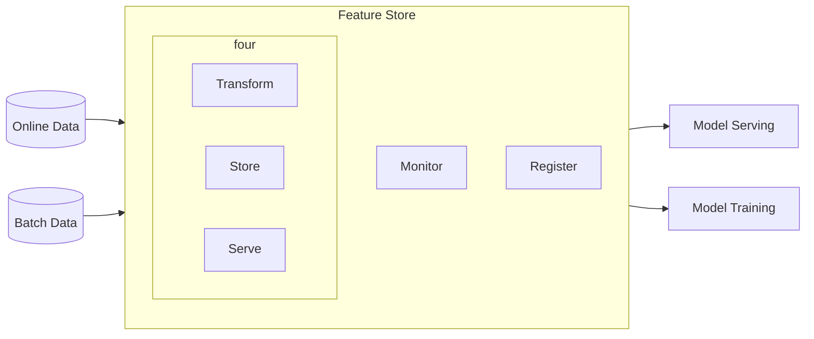

# Metrics Stores vs Feature Stores

Deriving value from data, whether for consumption or further value generation within a (machine learning) system requires care, ingenuity, and a team of motivated problem solvers with a shared goal. To accomplish this task, to derive value from data, we have the metrics stores and the feature stores.

## Table of Contents

1. Overview
2. Metrics
3. Metrics Stores
4. Features
5. Features Stores
6. Advantages and Similarities
7. Disadvantages and Differences
8. Why do we need Stores?
9. When should you adopt either?
10. What should I look for in either solution?
11. Recap

TL;DR

> "You should consider Metrics Stores and Feature Stores as part of the building blocks of your data and ML stacks when, regardless of the size of your org, you have different teams building analytical products that benefit from the same information in a consistent way."

## 1. Overview (Motivating your KPIs and Movies Recommendations)

An almost ubiquitous aspect of modern life is that most of us have and need a job to put food on the table and pay for services such as Netflix, which provide us with entertainment for our lazy Sunday fix. To get through our jobs, and be successful in our chosen careers, some of us need to achieve goals that are usually measured in terms of Key Performance Indicators (KPIs) or metrics. These KPIs might directly or indirectly affect the performance of our team, or a key parameter of the success of our company. On the other hand, for Netflix to personalize our experience on those lazy Sundays, and recommend us the next best movie, it needs to know some of the characteristics, or features, that make us who we are in and outside of the platform (e.g., gender, age, most watched genre, ...). You could say that some aggregation of us and others similar to us, are part of Netflix's KPIs.

The number of metrics and features needed for each -- work and a custom experience -- can be plenty and their complexity (i.e., the ways in which each is generated) has no creative ceiling. In other words, just as purchasing a carton of milk and a t-shirt could be done at their respective dairy and cotton farms, generating metrics and features could be done from their respective databases. What we want would just need to be assembled by milking the cows, sewing the cotton, and writing SQL queries. Luckily, to solve all these problems we have convenience, clothing, metrics and feature stores, and in this blog post we'll cover the latter two, so let's start with metrics.

## 2. Metrics

Out of the many similarities companies share, the most notable one is that they all have metrics they need to track to observe the overall progress of their organizations. After all, regardless of the product or service a company may provide, "if you can not measure it, you cannot improve it."

A more technical definition of metrics tells us that these are *quantifiable measures used to track and asses the status of a specific process at a given point in time*. To put this into perspective, imagine that you are in the business of selling nicely packaged bundle of spirits and mixers (a.k.a. you own a bar), and that you'd like to know as precisely as possible how many, and which of the drinks you sell, improves best the financial health of your bar, e.g. whether cocktails or beers pay best for you bar's rent, staff salary, overall supplies, etc. One way to figure this out would be with the metrics `revenue_per_menu_cocktail` (which contains all of the signature cocktails you have worked so hard to create) and `revenue_per_classic_drink` (which may contain beers or some of the classics such as an old fashion, a manhattan, or a cosmopolitan).

These metrics would help us observe and understand how what we provide to our customers will affect the bottom line of our business. Metrics may not mean much to people outside our bar, but they represent a map we should use to help guide one or more goals, e.g. to be the best bar in the world. To illustrate how these metrics get created, assume all transactions get placed into the following table.

| Idx | Item (S=Signature)       |Price|    Date   |Quantity|Signature|
|:---:|:------------------------:|:---:|:---------:|-------:|:-------:|
|  0  | Old Fashion              |  17 | 03-Jan-22 |    2   |    0    |
|  1  | Shiny Palace (S)         |  24 | 03-Jan-22 |    4   |    1    |
|  2  | Multi-vodkaTini (S)      |  23 | 03-Jan-22 |    1   |    1    |
|  3  | Pale Ale                 |   7 | 03-Jan-22 |    3   |    0    |
|  4  | Lager                    |   6 | 04-Jan-22 |    3   |    0    |
|  5  | Crazy Tiki Tower (S)     |  28 | 04-Jan-22 |    2   |    1    |
|  6  | Bananalicious Martini (S)|  25 | 04-Jan-22 |    1   |    1    |
|  7  | Aperol Spritz            |  15 | 04-Jan-22 |    2   |    0    |
|  8  | Caribbean Sugarum (S)    |  25 | 05-Jan-22 |    2   |    1    |
|  9  | Watermelicious (S)       |  25 | 05-Jan-22 |    1   |    1    |
| 10  | Manhattan                |  17 | 05-Jan-22 |    3   |    0    |
| 10  | Brown Ale                |  15 | 05-Jan-22 |    2   |    0    |

When we think of metrics we think of aggregated results by different dimensions. In this instance, a dimension is the same as a column in the table above and a measure to aggregate by is usually a time dimension. 

| Idx | day_of_year |Price| Date |Quantity| Is Signature |
|:---:|:-----------:|:---:|:--------:|-------:|:----:|
|  0  |    Day 1    | 17 | 03-Jan-22 |    739 |  0 |
|  1  |    Day 1    | 24 | 03-Jan-22 |    739 |  1 |
|  2  |    Day 2    | 23 | 03-Jan-22 |    739 |  1 |
|  3  |    Day 2    | 17 | 03-Jan-22 |    739 |  0 |
|  4  |    Day 3    | 24 | 03-Jan-22 |    739 |  1 |
|  5  |    Day 3    | 23 | 03-Jan-22 |    739 |  1 |

Metrics vary by industry and company, but there are overlaps across both. For example, different dating apps optimize daily active users (DAU), which is the ratio between users that log into the app on a given day, over the number of all users registered on the app at that point in time. While this example is context specific, DAU is a universal metric for companies with a subscription service like Spotify (a music provider) and the NY Times (a news provider). In contrast, metrics that are specific to a product, especially those with a patent behind them will be unique and valuable for, the company developing or using such product. For example, the gaming industry is notorious for its patent applications and, as such, some of their metrics range from complex marketplaces within games using real currency to new video rendering systems that increase the quality of the game.

As you can imagine, all these metrics require data and companies collect it in different variety, with distinct velocity, veracity, and validity. Moreover, different departments such as finance and marketing might need to create unique metrics or share similar ones across the organization. After all, if we wanted to create a report based on the metrics from these two teams, we'd like to use the finance's team revenue recipe, and the marketing's team ad conversion recipes rather than one curated by anyone else in the company. Beyond acquiring such metrics, we would use downstream applications for analysis. With that in mind, it follows that there has to be a better way to collaborate across teams and keep track of what's important to our companies, and the solution to this is what we'll cover next, the Metrics Stores.

## 3. Metrics Stores

Think about the last time you went to your local supermarket, chances are, you knew the items you needed, the isle where they were located at, and the ballpark price of your bill -- unless the last time you went was at the height of COVID-19 and one of the items you were searching for was toilet paper. With that in mind, imagine having the same consistent option but for the metrics that your company deems important? Yes, a convenient metrics supermarket were at the front door you would be able to see a catalog of all your metrics (including the ones on sale). A Metrics API so that if you were to connect your downstream application of choice (or order your desire piece of poultry at the deli), a quick set of specifications would do the job. A metrics framework to specify and manage your metrics once (an app were you could ask for most of the things you need before you arrived at the supermarket).

TODO: Add drawing of stick person staring in awe at an empty shell on the isle where toilet papers used to go during COVID. Don't forget the mask.

This option of à la carte metrics exists already and is offered by Transform, Supergrain, and GoodData. Other DIY approaches are tackled by frameworks such MetriQL, which sits on top of dbt-core), and Cube.js.

A Metrics store works in the following way.
1. A metrics layer is placed in between your data and the downstream applications used by your team.
2. Teams define global and local metrics once, usually through the combination of SQL code and one or more YAML files, and these files are given to the metrics layer for consumption. 
3. Downstream applications like Power BI, Hex, Tableau, and an environment like Jupyter Lab, can access all the metrics in the store via a Metrics Query Language API.

Having the core files as YAML files allows you and your team to use software engineering best practices and version control each metrics, or group of metrics, while making the process of modifying one or more that which follows the (1) pull requests, (2) review, (3) change and (4) repeat process.

In addition to being able to track each definition of a metric, once you are in a downstream tool such Mode or a Jupyter Notebook-like environment you can retrieve dataframes with your metrics of choice and begin your insights quest.

Before metrics stores existed, data professionals had to write the metrics logic for their desire data set, load it into their downstream application of choice (e.g. Tableau or Power BI), and proceed to do their analysis. This metric logic was (and still is to some degree) in the form of an OLAP cube (Online Analytical Processing), which is a 

In addition, this process would take place across different teams, making it prone to defining and reporting on the same metrics using different logic.

## 4. Features

Features are numerical representations of raw data and they are used to train machine learning models. Notice that the word **numerical** holds a lot of weight as features without the appropriate representation (e.g. hot and cold versus 1 and 0, respectively), will not be of any use to a model. In other words, a feature refers to a column in a tabular-like dataset. Let's recap the machine learning workflow.

TODO: Drawing of the machine learning cycle.

In the image above you can see that a machine learning project starts with a problem that can be solved with data. These data may require some preparation before we get to use it to train a model, and once we have such model, we go through an evaluate-fine-tune-train loop to maximize performance. Once we are done with our model, we deploy it and monitor the predictions it makes. This cycle of producing an ML model is enabled by features and, sometimes, a process called feature engineering.

TODO: Drawing of a carpenter or architect putting together the features of a building, house, office or anything.

Feature engineering "is the process of formulating the most appropriate features given the data, the model, and the task." Formulating these new features help us extract information from rich pieces of data such as dates (e.g. 12-Jan-2022 14:20:17) and locations (e.g. 123 Startup St, San Francisco, CA 02022, USA). Conversely, it also helps us compress multiple variables with similar information into less variables that would take away redundant features and noise out of the modeling stage.

Now that we just had a refresher of the ML life cycle, what features are, and why feature engineering is important, the next logical question would be: how do these work in live environments where users may lack the patience for models the data to be transformed and processed while providing a prediction?

We will look at the answer to this question in the following section.

## 5. Features Stores

Just as metrics stores make it easier for data professionals to look for the data they need, when they need it, how they need it, and fast, the ML world has a similar product for its own data use case, the feature store.

Feature stores were created to address the, among many things, the data preparation gap between batch and online predictions. The former is used to make predictions in groups and at different time intervals, while the latter worries about making predictions in as close to real-time as possible. Both approaches are extremely important but, depending on the nature of a business, online predictions may carry more weight than the batch predictions. For example, customers waiting for an Uber ride don't want to wait for hours to know how long it will take to arrive at their desire destination until an estimated time of arrival has been predicted. Similarly, movie recommendations sent to me out once a day to my email might not be as effective at keeping me on the app than live recommendations that appear as soon as I I finish a movie. So now that we have a general idea of what feature stores are, let's go into the finer details.

Feature stores are "an ML-specific data system that runs data pipelines that transform raw data into feature values, stores and manages the feature data itself, and serves data consistently for training and inference purposes." A feature store allows users to define features (yes, in a similar way in which metrics stores allow users to define metrics), transform, serve, and share them, and, in some cases, monitor them for distribution drift.

NB: Not all open-source options but most commercial ones, allow for distribution drift monitoring.

TODO: image of user interacting with an application, Speedy Gonzalez taking the data quickly via a REST API request to the feature store, which then gives is to the model, which then gets a predictions, and speedy returns the output to the user within 0.04 seconds.

A blog post in [Feast](feast.dev) -- an open feature store library in Python -- succinctly describes the data transformation criteria of a feature store into three types of features: Batch, streaming, and on-demand.

Transformations on batched data are probably the most common ones out there as this is the historical data used to train machine learning models. Here we have all the information we have collected about our users, plus any other external data we have used to improve our models. These models built on batched data can be used anywhere from providing decision-making support (where to send the next group of cops to) to providing us with a movie recommendation on Netflix.

Conversely, when we talk about transformation applied on streaming data, these need not be applied on the fly (i.e. in "real time") but rather in small intervals (e.g. 5, 10, 15, 20 minutes, etc.). This differs, and often gets confused with, on-demand transformations which require very low-latency to match the speed at which users interact with an application or website. Once these features are grabbed by the feature store, they are sent via a GET request to an API with our model. If this API is expected to get (pun intended) hit very frequently with requests, it will wrapped in a container and orchestrated via something like Kubernetes or another more cloud-specific product.

Without getting too deep into the weeds on the topic of serving ML models in production, the reason why the preferred way of serving a model is via an API is because if these were to be embedded into an application, every time we wanted to update the model we would have to update the application.

## 6. Advantages and Similarities

Today, metrics stores solve many problems in and outside the modern data stack. Some advantages and solutions to these problems are, no more inconsistency across metrics, wasted time writing queries/code rather than insight, inaccurate values at the time of reporting, lack of governance and trust around what matters, duplicate data, or increased costs with the use of cloud resources, among many others.

Some of the advantages above also overlap with those of a feature store. For example, imagine two data science teams building models  for different purposes but with the same data, might end up creating the feature DAU with different logic. One might defined this feature as `active_users` / `all_users` while another team might define it as (`active_users` + `daily_subscribers`) / `all_users`. You might think, what's the big deal with the two, and the answer is distribution drift. While it is not preposterous to think that a new subscriber might also be using the app, this is not always the case.

TODO: drawing of girl, guy, them, they, downloading app, showcase this in a matrix. One logs in, finishes the set up and starts swiping, one dreads the thought of not having their identity as an option, another can't pick the right pictures, and another cannot think of any clever prompts. Last drawing, all walking away and one stays swiping.

Imagine you just downloaded a dating app and that, as you go through the set up, you encounter that your pronouns and gender identity are not available, that you can't think of something clever to put down as a prompt for your profile, or that you struggle to pick the right pictures. All these problems make you put off **logging in** and start swiping until later but meanwhile, you have already signed up to the app and that extra data point for the latter DAU example is just, well, noise.

That said, other great advantages of feature stores it that they engineer your features on the fly so that your model can make predictions in an **online environment**. They abstract away the complexity of having multiple data pipelines and enable sharing features across teams. Which in turn reduces development time and increases collaboration across teams. Not every data scientist thinks the same way and/or will have the foresight or experience to create the same features. Making the collaboration part a key piece of FSs.

## 7. Disadvantages and Differences

Both kinds of stores require some technical expertise on the set up side, more so than on the usage side. Metrics stores can be set up by the "X" or "data" engineering team and be consumed via a user interface where your typical click-and-drop functionality can coexist with version-controllable code for more complex use. In contrast to a system that will most-likely not be consumer-facing, but rather a consumer's consumer, the feature stores will interact with online data to reshape it and feed it to a machine learning algorithm for prediction. This makes the live portion of the latter a tricky one to get right as some features might have been engineered via a complex aggregations with or without external data weaved into the mix -- for good measure (pardon the pun).

A disadvantage shared by both is that these are tools that will be easier to adopt by larger companies and not small ones. Building a solution for your FS requires (as mentioned above) serious engineering skills, thorough testing, and maintenance, and while these can be done by the end-user, the same is not true for MSs. The process of creating one from scratch with some of the open-source tools available (e.g. MetriQL, M3, cube.js, etc.) would require, at the very least, a dedicated person, if not a team and some decisions might be driven by efficiency and habit rather than the end-user itself as this person might not be involved in the creation of the store.

TODO: cartoon showing excel spreadsheet projection with whiteboard and more cells and columns in the background.

Another important point about either store is that handling large datasets in either direction, too many rows vs too many columns, is still a challenge in both spaces. If you think about the process of creating measures that matter for the company, a calculation based on too many data points might slow down the aggregation process. In contrast, hand-crafting 10 to 30 complex features to be tracked by the feature store might be a piece of cake, the same process with thousands could prove to be unproductive for both small and large teams.

A couple of important differences that may open up the discussion for the interoperability of the two include the following. (1) Metrics can be fed to an ML model but features might meaningless as metrics. (2) Feature stores are optimized for online usage while metrics stores work (mostly, although not solely) with batch data. (3) Metrics tend to have a longer shelf-life than features, meaning, features can come and go as the products and services of a company mature, but a measure of company success need not be touched nor changed by anyone. (4) MSs should support simple-to-complex metrics while FSs should make the simple ones easy to implement to iterate fast and effectively.

### Metrics vs Features Examples
TODO: add images of churn from the presentation

One way to differentiate the two, metrics vs features, is by thinking through the problem of churn. In the former you have a ratio represented by the amount of customers that have left you divided by the amount of customers you still have, across some time dimension (e.g. day, week, month, quarter, etc.). In the latter you have churn represented as a 1 or a 0, churned or current customer, and your job is to use some or all of the features at your disposal to train an algorithm that will learn to predict this 0 or 1.

In essence, in one instance you are looking at an aggregation of customers by a time component while in the other you are looking at each individual observation and their characteristics. Another way of thinking of this is that the former is more human friendly while the latter is more machine friendly. The word friendly in the metrics context means that the max number of observations you might see will 365 (if looking at daily churn), while for a machine learning problem you could be staring at an endless list of customers for days, weeks, etc.

TODO: Add cartoon starting at a graph going up or down with churn, and another of a person with glasses staring at an endless spreadsheet with data.

## 8. Why do we need Stores?
The main reasons we need stores for our metrics and features overlap with the same reasons we need a supermarket and a clothing store. While we can go and hunt for food every day, or weave away the clothing pieces we want to wear, the reality is that it is much better to have the creation and distribution of commonly used products (just like metrics and features) in one place and create some separation of concerns between core activities for daily functioning and value added from other businesses.

Having your metrics logic separate from a downstream application will allow data consumers to spend more time deriving insights in the same way not having to hunt would allow a chef to spend more time in the kitchen worrying about the flavor and taste of food. In contrast, handing over the feature creation and serving process to a feature store would allow a team of data scientist to focus on creating and productionising ML at their organizations.

Defining metrics as code and making it so that changes to a metric definition have to follow software engineering best practices will help put in place a systematic process that is both battle tested and scalable. In addition, it could have the added effect of improving an organisation's analytics' team into the direction of software engineers.

A feature based on human behavior will always be at a distribution shift risk as we change our minds all the time or our preferences tend to change due to changes in our environment. Hence, being able to detect changes between a while back and now is a unique selling point feature stores offer.

## 9. When should you adopt either?
If you want to empower more data-producers and consumers at your organization to take advantage of the data at their disposal, all while keeping the consistency of metrics' definitions in check, then a metrics store might be a good solution for you.

If ML is not a "nice-to-have" at your organization, online serving is part of your core offering, all of your data scientists and ML Engineers share and reuse the same features, and you need a way t monitor the distribution shifts between historical and incoming data, a feature store might be the right solution for you.

## 10. What should I look for in either solution?

On the metrics store side, the most important characteristics to look for include (1) a **metrics framework** where you could define and manage your metrics once. (2) A **metrics catalog** that provides an interface for your metrics knowledge. And (3) a **metrics API** to allow your store to meet consumers where they are at.

On the feature store side, the most important characteristics to look for include (1) single feature definition for production and training. (2) Ability to track and monitor feature distributions across training and serving. (3) Seamless integration between online and batch prediction.

## 11. Recap
Metrics allow us to track what matters for our organizations while features are the fuel for the machine learning models created by our data scientists to provide personalized experiences, among others. Metrics stores give us a platform to write, govern, and serve metrics in a common language, and feature stores abstract away the reshaping of features while providing scalability in both, online and offline serving.

Lastly, if you need consistency, scalability, reusability, and any other x-ability to boost the performance of your data-driven decision process as well as your ML operations, then you might want to think about adopting one or both of these stores.

> Metrics Stores and Feature Stores are like the maestro/conductor of an orchestra, while the muscisians can still perform without one, you can only hope for good synchronization.